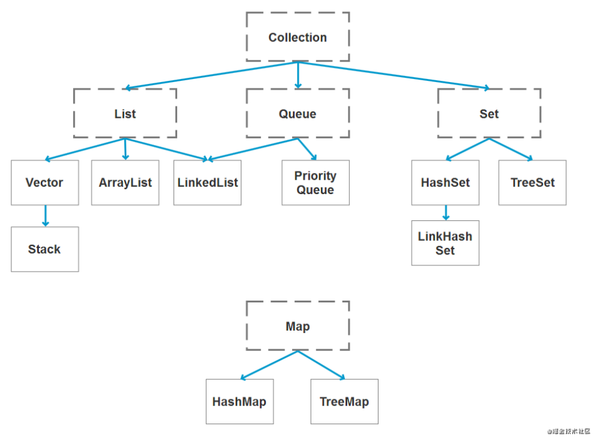

# 这是标题 `sdf_sdf`
# 
一级标题
  

## 二级标题
### 三级标题
#### 四级标题
##### 五级标题
###### 六级标题
****
<u>sdfsf</u>  

1. 第一项：
    * 第一项嵌套的第一个元素
    - 第一项嵌套的第二个元素  
2. 第二项：  
    - 水电费  
3. 第三项：
    > 菜鸟教程
> 区块中使用列表
>1. 第一项  
4. 第四项：  
    * 士大夫

|  表头第三方   | 表头  |
|  :----  | :----  |
| 单元格  | 单元格 |
| 单元格  | 单元格 |

